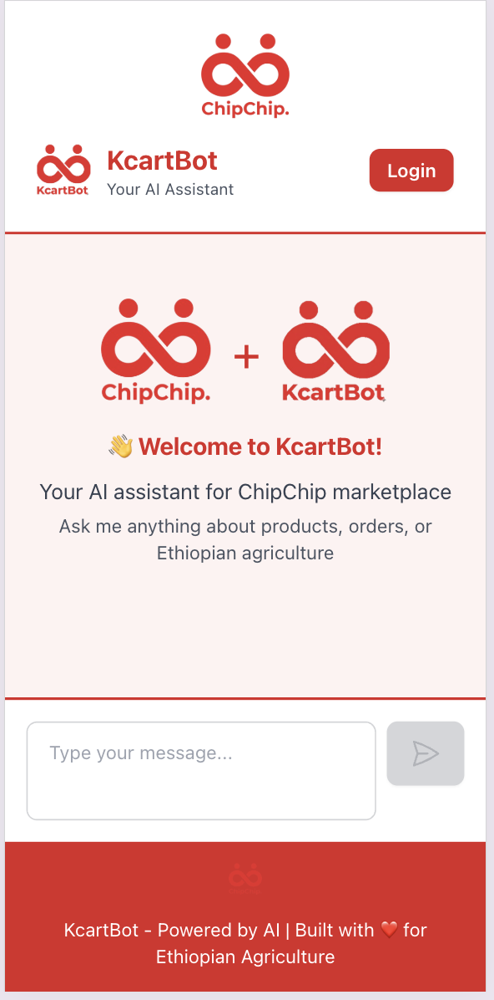

# KcartBot by ChipChip
## AI-Powered Ethiopian Agricultural Marketplace Assistant

<div align="center">


**Connecting Ethiopian Farms to Tables Through Intelligent Conversation**

An AI-powered marketplace assistant powered by LangChain, Google Gemini, and RAG technology. Experience seamless agricultural commerce in English and Amharic.

[](https://www.djangoproject.com/)
[](https://reactjs.org/)
[](https://www.langchain.com/)
[](https://ai.google.dev/)
[]()

</div>

---

## 📑 Table of Contents

- [Overview](#-overview)
- [Architecture](#-architecture)
- [Key Features](#-key-features)
- [Technology Stack](#-technology-stack)
- [Application Structure](#-application-structure)
- [Setup Instructions](#-setup-instructions)
- [Usage Guide (Testing Script)](#-usage-guide-testing-script)
- [Architectural Decisions](#-architectural-decisions)
- [Future Improvements & Scalability](#-future-improvements--scalability)
- [Performance Metrics](#-performance-metrics)
- [Dependencies](#-dependencies)

---

## 🌟 Overview

KcartBot is an **AI-powered marketplace assistant** that revolutionizes how users buy and sell agricultural products. Built on cutting-edge AI technology, KcartBot combines:

- **LangChain** for intelligent agent orchestration
- **Google Gemini 2.5 Flash** for natural language understanding and translation
- **ChromaDB** for knowledge retrieval (RAG system)
- **PostgreSQL** for secure transactional data
- **Redis** for real-time WebSocket communication

The intelligent assistant serves multiple user roles:
- **🎯 Customers**: Discover products, compare suppliers, place orders seamlessly
- **🏪 Suppliers**: Manage inventory, receive pricing insights, fulfill orders, generate product images with AI
- **👥 Visitors**: Learn about the platform and Ethiopian agricultural practices

### Mobile-Responsive Design

<div align="center">

<table>
<tr>
<td width="50%">


*Desktop Interface*

</td>
<td width="50%">


*Mobile-optimized for on-the-go access*

</td>
</tr>
</table>

</div>

### Why KcartBot?

Traditional e-commerce interfaces can be complex, especially for users with varying levels of digital literacy. KcartBot makes agricultural commerce accessible through natural conversation in both **English** and **Amharic** (Fidel and Latin scripts), removing barriers and empowering users to participate in the digital marketplace.

---

## 🏗️ Architecture

### Complete System Architecture

KcartBot employs a sophisticated multi-layer architecture that combines AI agents, vector databases, relational databases, and real-time communication:

```mermaid
graph TB
    subgraph "Client Layer"
        USER[👤 User Browser]
    end
    
    subgraph "Frontend - React Application"
        UI[React UI Components]
        AUTH_CTX[AuthContext]
        CHAT_UI[ChatInterface]
        WS_CLIENT[WebSocket Client]
        HTTP_CLIENT[API Client - Axios]
    end
    
    subgraph "Backend - Django Application"
        subgraph "API Layer"
            REST_API[Django REST Framework]
            AUTH_API[Djoser Auth]
            CHAT_VIEW[ChatAPIView]
            NOTIF_VIEW[NotificationAPIView]
            ORDER_VIEW[OrderActionAPIView]
        end
        
        subgraph "WebSocket Layer - Django Channels"
            WS_ROUTING[WebSocket Routing]
            CHAT_CONSUMER[ChatConsumer]
            TOKEN_MIDDLEWARE[TokenAuthMiddleware]
        end
        
        subgraph "AI/ML Layer"
            AGENT_FACTORY[Agent Factory]
            LANGCHAIN[LangChain Executor]
            TOOLS[Agent Tools]
        end
        
        subgraph "Business Logic"
            DB_TOOL[Database Tool]
            RAG_TOOL[RAG Tool]
            IMG_GEN[Image Generator]
            TRANSLATOR[Translator]
        end
    end
    
    subgraph "External Services"
        GEMINI[🤖 Google Gemini API]
        RUNWARE[🖼️ Runware API]
    end
    
    subgraph "Data Storage"
        POSTGRES[(🗄️ PostgreSQL)]
        CHROMA[(🔍 ChromaDB)]
        REDIS[(⚡ Redis)]
    end
    
    %% Connections
    USER --> UI
    UI --> CHAT_UI
    CHAT_UI --> HTTP_CLIENT
    CHAT_UI --> WS_CLIENT
    
    HTTP_CLIENT -->|HTTP/REST| REST_API
    WS_CLIENT -->|WebSocket| WS_ROUTING
    
    REST_API --> CHAT_VIEW
    CHAT_VIEW --> TRANSLATOR
    CHAT_VIEW --> AGENT_FACTORY
    AGENT_FACTORY --> LANGCHAIN
    LANGCHAIN --> TOOLS
    
    TOOLS --> DB_TOOL
    TOOLS --> RAG_TOOL
    TOOLS --> IMG_GEN
    
    DB_TOOL --> POSTGRES
    RAG_TOOL --> CHROMA
    RAG_TOOL --> GEMINI
    IMG_GEN --> RUNWARE
    TRANSLATOR --> GEMINI
    LANGCHAIN --> GEMINI
    
    WS_ROUTING --> CHAT_CONSUMER
    CHAT_CONSUMER --> REDIS
    
    classDef frontend fill:#61dafb,stroke:#333,stroke-width:2px,color:#000
    classDef backend fill:#092e20,stroke:#333,stroke-width:2px,color:#fff
    classDef ai fill:#9b59b6,stroke:#333,stroke-width:2px,color:#fff
    classDef external fill:#f39c12,stroke:#333,stroke-width:2px,color:#000
    classDef storage fill:#27ae60,stroke:#333,stroke-width:2px,color:#fff
    
    class UI,CHAT_UI,WS_CLIENT,HTTP_CLIENT frontend
    class REST_API,CHAT_VIEW,WS_ROUTING,CHAT_CONSUMER backend
    class AGENT_FACTORY,LANGCHAIN,TOOLS,RAG_TOOL,TRANSLATOR ai
    class GEMINI,RUNWARE external
    class POSTGRES,CHROMA,REDIS storage
```



### AI Agent Architecture

The core intelligence of KcartBot lies in its role-based AI agent system:


### LangChain Agent Execution Flow


---

## ✨ Key Features

### 1. Intelligent RAG System (Retrieval Augmented Generation)

KcartBot uses ChromaDB to store and retrieve ChipChip company knowledge, enabling accurate responses about company policies, services, and agricultural information.

<div align="center">


*RAG system providing accurate company information*

</div>

**How it works:**
- Company knowledge is embedded using Google's Gemini Embedding 001
- Stored in ChromaDB vector database
- Retrieved via semantic similarity search
- Top 3 relevant documents provided as context to LLM

### 2. LLM's Own Knowledge for General Topics

For general agricultural questions, the LLM uses its trained knowledge without querying external databases:

<div align="center">


*Using LLM's knowledge for general agricultural advice*


*Providing Ethiopian-specific agricultural information*

</div>

### 3. Multi-Language Support

Automatic language detection and translation for English and Amharic (both Fidel and Latin scripts):

**Supported Languages:**
- English: "Hello, how can you help me?"
- Amharic (Fidel): "ሰላም እንዴት ልርዳዎት እችላለሁ?"
- Amharic (Latin): "selam indemin neh?"

### 4. Customer Features: Product Discovery & Ordering

#### Product Search and Supplier Comparison

<div align="center">


*Customers can search for products and compare suppliers*

</div>

#### Intelligent Product & Supplier Suggestions

<div align="center">


*AI suggests best suppliers based on price and availability*

</div>

#### Order Placement

<div align="center">


*Seamless order creation with delivery details*

</div>

#### Order Confirmation

<div align="center">


*Instant order confirmation with details*

</div>

### 5. Supplier Features: Inventory & Order Management

#### Real-Time Order Notifications

<div align="center">


*Suppliers receive instant order notifications via WebSocket*

</div>

#### Order Management

<div align="center">


*Suppliers can view, accept, or decline orders*

</div>

#### Inventory Checking

<div align="center">


*Real-time inventory status and alerts*

</div>

#### AI-Powered Pricing Suggestions

<div align="center">


*Data-driven pricing recommendations based on market analysis*

</div>

**Pricing Intelligence:**
- Analyzes competitor prices across different tiers
- Reviews historical sales data
- Provides optimal price range (±10% of market average)
- Displays highest volume price from last 30 days

#### Adding Products to Inventory

<div align="center">


*Guided inventory addition with pricing insights*

</div>

#### AI Image Generation for Products

<div align="center">


*Generate professional product images using Runware AI*

</div>

**Image Generation Workflow:**
1. Supplier provides product description
2. AI generates professional product photo (1024x1024)
3. Supplier reviews and approves
4. Image attached to inventory listing

### 6. Real-Time Communication

- **WebSocket Integration**: Instant notifications for orders and alerts
- **Ping/Pong Keep-Alive**: Maintains stable connections
- **Redis Channel Layer**: Scalable message broadcasting
- **Group-Based Messaging**: User-specific notification delivery

### 7. Background Job Scheduling

- **Expiring Stock Alerts**: Automated checks every 5 minutes
- **Smart Notifications**: Alerts suppliers 7 days before expiry
- **Duplicate Prevention**: Checks for recent notifications
- **APScheduler Integration**: Reliable task execution

---

## 💻 Technology Stack

### Backend

| Technology | Version | Purpose |
|------------|---------|---------|
| Django | 5.2.7 | Web framework |
| Django REST Framework | 3.15.2 | API development |
| Djoser | 2.3.0 | Authentication |
| Django Channels | 4.2.0 | WebSocket support |
| Channels Redis | 4.2.1 | WebSocket backend |
| LangChain | 0.3.13 | AI agent orchestration |
| LangChain Google GenAI | 2.0.9 | Gemini integration |
| ChromaDB | 0.6.2 | Vector database |
| APScheduler | 3.11.0 | Background tasks |
| Runware | 0.5.2 | AI image generation |

### Frontend

| Technology | Version | Purpose |
|------------|---------|---------|
| React | 18.3.1 | UI framework |
| Vite | 5.4.10 | Build tool |
| Tailwind CSS | 3.4.15 | Styling |
| DaisyUI | 4.12.14 | Component library |
| Axios | 1.7.7 | HTTP client |
| React Markdown | 9.0.1 | Message rendering |

### Infrastructure

| Service | Purpose |
|---------|---------|
| PostgreSQL | Relational database for transactional data |
| Redis | Channel layer for WebSocket, caching |
| ChromaDB | Vector database for RAG system |
| Google Gemini | LLM, embeddings, translation |
| Runware | AI image generation |

---

## 📂 Application Structure

### Core Custom Code (Written Components)

```
KcartBot-chipchip-/
├── backend/
│   ├── api/                            # Main Django application
│   │   ├── agent/
│   │   │   └── factory.py              # ⭐ Agent factory - role-based agent creation
│   │   ├── tools/
│   │   │   ├── database_tool.py        # ⭐ Database operations (products, orders, inventory)
│   │   │   └── rag_tool.py             # ⭐ RAG system - ChromaDB vector search
│   │   ├── utils/
│   │   │   ├── image_generator.py      # ⭐ Runware AI image generation
│   │   │   └── translator.py           # ⭐ Multi-language translation (EN ↔ AM)
│   │   ├── management/commands/
│   │   │   └── check_expiring_stock.py # ⭐ Automated inventory expiry checks
│   │   ├── consumers.py                # ⭐ WebSocket consumer for real-time messaging
│   │   ├── middleware.py               # ⭐ Token authentication for WebSocket
│   │   ├── models.py                   # ⭐ Database models (User, Product, Order, etc.)
│   │   ├── routing.py                  # ⭐ WebSocket URL routing
│   │   ├── scheduler.py                # ⭐ APScheduler configuration
│   │   ├── serializers.py              # ⭐ DRF serializers
│   │   ├── signals.py                  # ⭐ Django signals for notifications
│   │   ├── urls.py                     # ⭐ API URL patterns
│   │   └── views.py                    # ⭐ API views (Chat, Notifications, Orders)
│   │
│   ├── backend/
│   │   ├── asgi.py                     # ⭐ ASGI configuration for WebSocket
│   │   ├── settings.py                 # ⭐ Django settings (Channels, CORS, etc.)
│   │   └── urls.py                     # ⭐ Main URL configuration
│   │
│   ├── data/                           # Sample data files
│   │   ├── chipchip_knowledge.json     # ⭐ Company knowledge for RAG
│   │   ├── competitor_prices.csv       # Historical competitor pricing data
│   │   ├── inventory.csv               # Sample inventory data
│   │   ├── order_items.csv             # Order line items
│   │   ├── orders.csv                  # Sample order data
│   │   ├── products.csv                # Product catalog
│   │   └── users.csv                   # Sample user data
│   │
│   ├── scripts/
│   │   ├── data_generation/            # ⭐ Scripts to generate synthetic data
│   │   │   ├── competitor_data_generator.py
│   │   │   ├── constants.py
│   │   │   ├── inventory_data_generation.py
│   │   │   ├── orders_data_generator.py
│   │   │   ├── products_data_generation.py
│   │   │   └── user_data_generation.py
│   │   └── data_loading/               # ⭐ Scripts to load data into databases
│   │       ├── load_relational_data.py
│   │       └── load_vector_data.py
│   │
│   └── requirements.txt                # Python dependencies
│
├── frontend/
│   ├── src/
│   │   ├── components/                 # ⭐ Custom React components
│   │   │   ├── AuthModal.jsx
│   │   │   ├── ChatInterface.jsx
│   │   │   └── OrderNotification.jsx
│   │   ├── context/
│   │   │   └── AuthContext.jsx         # ⭐ Global authentication state
│   │   ├── utils/
│   │   │   ├── api.js                  # ⭐ Axios API client
│   │   │   └── websocket.js            # ⭐ WebSocket connection manager
│   │   ├── App.css                     # ⭐ Application styles
│   │   ├── App.jsx                     # ⭐ Main React component
│   │   ├── index.css                   # ⭐ Global styles with Tailwind
│   │   └── main.jsx                    # React entry point
│   │
│   ├── public/
│   │   ├── chipchiplogo.png            # Custom logo
│   │   └── kcartbot.png                # Custom logo
│   │
│   ├── index.html                      # HTML entry point
│   ├── package.json                    # Node.js dependencies
│   ├── tailwind.config.js              # ⭐ Tailwind configuration
│   └── vite.config.js                  # ⭐ Vite proxy configuration
│
├── images_for_readme/                  # Screenshots for documentation
│
├── docker-compose.yml                  # ⭐ Docker services configuration
└── README.md                           # This documentation
```

**Legend:** ⭐ = Core custom-written code

### Key Components Explained

#### 1. **Agent Factory (`factory.py`)**
- **Purpose**: Creates role-specific AI agents dynamically
- **Logic**:
  - Detects if user is authenticated
  - Determines user role (customer/supplier/unauthenticated)
  - Selects appropriate tools based on role
  - Builds custom system prompts
  - Returns configured LangChain agent executor

#### 2. **Database Tool (`database_tool.py`)**
- **Purpose**: Handles all database operations for the AI agent
- **Functions**:
  - `find_product_listings()`: Search products by name and quantity
  - `create_order_in_db()`: Create orders and notify suppliers
  - `check_existing_inventory()`: Check if supplier has specific product
  - `get_comprehensive_pricing_suggestion()`: Analyze market prices
  - `add_or_update_inventory()`: Manage supplier inventory
  - `get_supplier_inventory()`: View all inventory with expiry alerts
  - `get_supplier_orders()`: View orders with filtering
  - `update_order_status()`: Accept/decline orders, notify customers

#### 3. **RAG Tool (`rag_tool.py`)**
- **Purpose**: Retrieval Augmented Generation for company knowledge
- **Logic**:
  - Connects to ChromaDB vector database
  - Generates query embeddings using Gemini
  - Performs semantic similarity search
  - Returns top 3 relevant documents
  - Provides context to LLM for accurate responses

#### 4. **Translator (`translator.py`)**
- **Purpose**: Multi-language support (English ↔ Amharic)
- **Functions**:
  - `identify_language()`: Detects input language using Gemini
  - `translate_to_english()`: Converts Amharic to English for processing
  - `translate_from_english()`: Converts responses back to Amharic

#### 5. **Image Generator (`image_generator.py`)**
- **Purpose**: AI-powered product image generation
- **Integration**: Uses Runware API
- **Output**: High-quality 1024x1024 product images

#### 6. **WebSocket Consumer (`consumers.py`)**
- **Purpose**: Real-time bidirectional communication
- **Features**:
  - Token-based authentication
  - User-specific channel groups
  - Ping/pong keep-alive
  - Notification broadcasting

#### 7. **Django Admin (`admin.py`)**
- **Purpose**: Built-in admin interface for data management
- **Features**:
  - View and edit users, products, orders, inventory
  - Quick access to all database models
  - Useful for debugging and manual data operations
- **Access**: `http://localhost:8000/admin/` (requires superuser)

#### 8. **Database Migrations (`migrations/`)**
- **Purpose**: Version control for database schema changes
- **Key Migrations**:
  - `0001_initial.py`: Creates all base models
  - `0002_notification_inventory_and_more.py`: Adds notification and inventory systems
  - `0003_conversationhistory_message_type_and_more.py`: Adds chat history tracking
  - `0004_orderitem_supplier.py`: Links order items to suppliers
  - `0005_inventory_image_url.py`: Adds image URL support to inventory
- **Usage**: `python manage.py migrate`

#### 9. **Data Generation Scripts**
- **Purpose**: Generate realistic synthetic data for testing
- **Scripts**:
  - `user_data_generation.py`: Creates customer and supplier accounts
  - `products_data_generation.py`: Generates Ethiopian agricultural products
  - `competitor_data_generator.py`: Creates competitor pricing history
  - `inventory_data_generation.py`: Generates supplier inventory with expiry dates
  - `orders_data_generator.py`: Creates order history with realistic patterns
  - `constants.py`: Shared constants (product names, locations, etc.)
- **Usage**: Run individually or via `load_relational_data.py`

#### 10. **Configuration Files**
- **`settings.py`**: Django configuration (database, installed apps, middleware, CORS, Channels)
- **`asgi.py`**: ASGI application for WebSocket support
- **`wsgi.py`**: WSGI application for traditional HTTP deployment
- **`vite.config.js`**: Frontend build configuration, proxy settings
- **`tailwind.config.js`**: Tailwind CSS theme and plugin configuration
- **`docker-compose.yml`**: Infrastructure services (PostgreSQL, Redis, ChromaDB)

#### 11. **Signals (`signals.py`)**
- **Purpose**: Automatic actions triggered by database events
- **Functionality**:
  - Creates WebSocket notifications when orders are created/updated
  - Sends real-time alerts to suppliers and customers
  - Decouples notification logic from business logic

---

## 🚀 Setup Instructions

### Prerequisites

- **Python** 3.10 or higher
- **Node.js** 18 or higher
- **Docker** and Docker Compose
- **Google Gemini API Key** ([Get one here](https://makersuite.google.com/app/apikey))
- **Runware API Key** ([Get one here](https://runware.ai/))

### Step 1: Clone the Repository

```bash
git clone https://github.com/your-org/KcartBot-chipchip-.git
cd KcartBot-chipchip-
```

### Step 2: Set Up Environment Variables

Create a `.env` file in the `backend/` directory:

```bash
# backend/.env
GOOGLE_API_KEY=your_google_gemini_api_key_here
RUNWARE_API_KEY=your_runware_api_key_here

# Optional: Database credentials (uses defaults if not set)
POSTGRES_DB=kcart
POSTGRES_USER=postgres
POSTGRES_PASSWORD=postgres
```

### Step 3: Start Docker Services

```bash
# Start PostgreSQL, Redis, and ChromaDB
docker-compose up -d

# Verify services are running
docker ps

# Should show:
# - kcart_postgres (port 5432)
# - kcart_redis (port 6379)
# - kcart_chromadb (port 8001)
```

### Step 4: Set Up Backend

```bash
cd backend

# Create virtual environment
python -m venv venv

# Activate virtual environment
# On macOS/Linux:
source venv/bin/activate
# On Windows:
venv\Scripts\activate

# Install dependencies
pip install -r requirements.txt

# Run migrations
python manage.py makemigrations
python manage.py migrate

# Load sample data (optional)
python scripts/data_loading/load_relational_data.py
python scripts/data_loading/load_vector_data.py

# Create superuser (optional, for Django admin)
python manage.py createsuperuser
```

### Step 5: Set Up Frontend

```bash
cd frontend

# Install dependencies
npm install
```

### Step 6: Start the Application

Open two terminal windows:

**Terminal 1 - Backend:**
```bash
cd backend
source venv/bin/activate  # or venv\Scripts\activate on Windows
python manage.py runserver
```

Backend will be available at `http://localhost:8000`

**Terminal 2 - Frontend:**
```bash
cd frontend
npm run dev
```

Frontend will be available at `http://localhost:5173`

### Step 7: Access the Application

Open your browser and navigate to `http://localhost:5173`

---

## 📖 Usage Guide (Testing Script)

This comprehensive testing script covers ALL features of KcartBot. Follow these steps to test every capability.

### Part 1: Testing Unauthenticated User Features (RAG & LLM Knowledge)

#### Test 1.1: RAG System - Company Knowledge

1. Open `http://localhost:5173`
2. **Type:** "What is ChipChip?"
3. **Expected:** Bot uses RAG tool to search ChromaDB and provides accurate company information
4. **Verify:** Response includes specific ChipChip details from knowledge base


#### Test 1.2: LLM's Own Knowledge - General Agriculture

1. **Type:** "How should I store tomatoes to keep them fresh?"
2. **Expected:** Bot uses its trained knowledge (no RAG) to provide storage tips
3. **Verify:** Response includes practical storage advice


#### Test 1.3: LLM's Own Knowledge - Ethiopian Agriculture

1. **Type:** "Tell me about Ethiopian coffee production"
2. **Expected:** Bot provides information from its training data
3. **Verify:** Response includes Ethiopian-specific information


#### Test 1.4: Scope Limitation

1. **Type:** "Who won the World Cup?"
2. **Expected:** Bot politely declines and states it only handles agricultural topics
3. **Verify:** Response redirects to agricultural scope

#### Test 1.5: Login Prompt for Marketplace Features

1. **Type:** "I want to order some tomatoes"
2. **Expected:** Bot prompts user to log in for marketplace access
3. **Verify:** Clear message about authentication requirement

---

### Part 2: Testing Customer Features

#### Test 2.1: User Registration (Customer)

1. Click the **"Login / Sign Up"** button in the top-right corner
2. Select **"Sign Up"** tab
3. Fill in the form:
   - **Username:** `test_customer`
   - **Email:** `customer@test.com`
   - **Password:** `testpass123`
   - **Role:** Select **"Customer"**
4. Click **"Sign Up"**
5. **Expected:** Account created, automatically logged in
6. **Verify:** UI shows user as authenticated

#### Test 2.2: Product Search

1. **Type:** "Show me available tomatoes"
2. **Expected:** 
   - Bot calls `find_product_listings` tool
   - Returns list of suppliers with prices and quantities
   - Each supplier shows: name, supplier_id, price, quantity
3. **Verify:** Response includes supplier details with IDs


#### Test 2.3: Product Search with Specific Quantity

1. **Type:** "I need 50kg of onions"
2. **Expected:**
   - Bot searches for onions with 50kg requirement
   - Shows only suppliers with sufficient stock
   - Displays prices sorted from lowest to highest
3. **Verify:** All suppliers have at least 50kg available


#### Test 2.4: Order Creation

1. **Type:** "I want to order 30kg of tomatoes from [supplier_id], deliver to Addis Ababa on 2025-11-15"
   - Replace `[supplier_id]` with an actual supplier ID from previous search
2. **Expected:**
   - Bot confirms order details
   - Creates order in database
   - Shows order confirmation with order ID
3. **Verify:** Order confirmation includes all details


#### Test 2.5: Order Confirmation

1. After creating order, check the response
2. **Expected:**
   - Order ID displayed
   - Total price calculated
   - Delivery details confirmed
3. **Verify:** Customer receives confirmation message


---

### Part 3: Testing Supplier Features

#### Test 3.1: User Registration (Supplier)

1. Logout from customer account
2. Click **"Login / Sign Up"**
3. Select **"Sign Up"** tab
4. Fill in the form:
   - **Username:** `test_supplier`
   - **Email:** `supplier@test.com`
   - **Password:** `testpass123`
   - **Role:** Select **"Supplier"**
5. Click **"Sign Up"**
6. **Expected:** Supplier account created and logged in

#### Test 3.2: Inventory Checking

1. **Type:** "Show my inventory"
2. **Expected:**
   - Bot calls `get_my_inventory` tool
   - Lists all active inventory items
   - Shows expiring items (within 5 days) with alerts
   - Suggests price reduction for expiring stock
3. **Verify:** Inventory list with product details


#### Test 3.3: Check Specific Product

1. **Type:** "Do I have tomatoes in stock?"
2. **Expected:**
   - Bot calls `check_existing_inventory` tool
   - Shows specific product details if available
   - Or states "No inventory found"
3. **Verify:** Specific product information returned

#### Test 3.4: Market Pricing Suggestion

1. **Type:** "What's the market price for onions?"
2. **Expected:**
   - Bot calls `get_pricing_suggestion` tool
   - Analyzes competitor prices by tier
   - Shows highest volume price from last 30 days
   - Provides recommended price range
3. **Verify:** Complete pricing breakdown displayed


**Expected Output Structure:**
```
Based on market data for the last 30 days:

Suggested price range: 23.40 - 28.60 ETB per unit

Highest volume price (last 30 days): 26.00 ETB per unit

Competitor averages:
- Distribution Centers: 30.50 ETB per unit
- Local Shops: 25.00 ETB per unit
- Supermarkets: 35.00 ETB per unit
```

#### Test 3.5: Adding Product to Inventory

1. **Type:** "I want to add 100kg of butter at 40 ETB per kg, available today, expires in 30 days"
2. **Expected:**
   - Bot first calls `get_pricing_suggestion` to provide market insights
   - Shows pricing recommendations
   - Asks if supplier wants to proceed
   - Asks about image generation
3. **Confirm:** "Yes, proceed with the suggested price"
4. **Expected:** Inventory created successfully


#### Test 3.6: AI Image Generation (Optional)

After deciding to add product:

1. Bot asks: "Would you like to generate an image for this product listing?"
2. **Type:** "Yes"
3. Bot asks for description
4. **Type:** "Fresh organic butter in a wooden bowl, professional product photography, high quality"
5. **Expected:**
   - Bot calls `generate_product_image` tool
   - Returns image URL
   - Displays image for review
6. Bot asks: "Do you like this image?"
7. **Type:** "Yes"
8. **Expected:** Inventory created with image URL attached


#### Test 3.7: View Orders

1. **Type:** "Show my orders"
2. **Expected:**
   - Bot calls `get_my_orders` tool
   - Lists all orders containing supplier's products
   - Groups by status: pending_acceptance, accepted, declined
   - Shows order details: customer, products, quantities, total
3. **Verify:** Orders listed by status


#### Test 3.8: Filter Orders by Status

1. **Type:** "Show my pending orders"
2. **Expected:** Only orders with status "pending_acceptance"
3. **Verify:** Filtered list returned

#### Test 3.9: Real-Time Order Notification

1. Keep supplier logged in
2. In another browser (or incognito window), log in as a customer
3. Customer creates an order including supplier's product
4. **Expected:**
   - Supplier receives WebSocket notification instantly
   - Order details appear in chat
   - Notification shows: order ID, customer, items, total
5. **Verify:** Real-time notification received


#### Test 3.10: Accept Order

1. After receiving order notification, note the order ID
2. **Type:** "Accept order #[order_id]"
   - Replace `[order_id]` with actual order ID
3. **Expected:**
   - Bot calls `update_order_status` tool
   - Updates order status to "accepted"
   - Sends notification to customer via WebSocket
4. **Verify:** Success message displayed

#### Test 3.11: Decline Order

1. **Type:** "Decline order #[order_id] because I'm out of stock"
2. **Expected:**
   - Order status updated to "declined"
   - Customer receives notification with reason
3. **Verify:** Decline reason included in notification

---

### Part 4: Testing Multi-Language Support

#### Test 4.1: Amharic (Fidel Script) Input

1. **Type:** "ሰላም እንዴት ነህ?"
2. **Expected:**
   - Bot detects language as "amharic"
   - Translates to English internally
   - Processes request
   - Translates response back to Amharic
   - Returns response in Amharic Fidel
3. **Verify:** Response in Amharic

#### Test 4.2: Amharic (Latin Script) Input

1. **Type:** "selam indemin neh?"
2. **Expected:**
   - Bot detects as "amharic_latin"
   - Processes and responds in Amharic Fidel
3. **Verify:** Response in Amharic Fidel script

#### Test 4.3: Mixed Language Conversation

1. **Type in English:** "Hello"
2. **Type in Amharic:** "የምን ፍሬ አለ?" (What fruits are available?)
3. **Expected:**
   - Bot switches language per message
   - Maintains conversation context
   - Responds in user's language
4. **Verify:** Consistent language detection and response

---

### Part 5: Testing Real-Time Features

#### Test 5.1: WebSocket Connection

1. Open browser developer tools (F12)
2. Go to Network tab → WS (WebSocket)
3. Refresh page after login
4. **Expected:**
   - WebSocket connection established
   - Connection URL: `ws://localhost:8000/ws/chat/?token=...`
   - Status: Connected
5. **Verify:** Green indicator or connection success

#### Test 5.2: Ping/Pong Keep-Alive

1. With WebSocket tab open in dev tools
2. Wait 30 seconds
3. **Expected:**
   - Ping messages sent every 30 seconds
   - Pong responses received
4. **Verify:** Connection stays alive

#### Test 5.3: Order Notification Delivery

1. Log in as supplier in one browser
2. Log in as customer in another browser
3. Customer creates order with supplier's products
4. **Expected:**
   - Supplier receives instant notification
   - No page refresh needed
   - Notification appears in chat interface
5. **Verify:** Real-time delivery confirmed

---

### Part 6: Testing Background Jobs

#### Test 6.1: Expiring Stock Alerts

1. Log in as supplier
2. Add product with expiry date within 7 days:
   - **Type:** "Add 50kg of milk at 30 ETB per kg, available today, expires in 3 days"
3. Wait for scheduler to run (every 5 minutes)
4. **Check notifications:**
   - Go to notifications page or
   - **Type:** "Show my notifications"
5. **Expected:**
   - Notification: "Stock Expiry Alert: Your milk inventory (50 kg) will expire in 3 days..."
6. **Verify:** Alert received

#### Test 6.2: Manual Trigger (Optional)

In terminal:
```bash
cd backend
python manage.py check_expiring_stock --days=7
```

**Expected:** Console shows notifications created

---

### Part 7: Testing Error Handling

#### Test 7.1: Invalid Order

1. As customer, **Type:** "Order tomatoes from supplier_xyz"
   - Use non-existent supplier ID
2. **Expected:** Error message: "Supplier not found"

#### Test 7.2: Insufficient Stock

1. **Type:** "I need 10000kg of tomatoes"
2. **Expected:** 
   - Either no suppliers returned
   - Or message indicating insufficient stock

#### Test 7.3: Unauthorized Action

1. As customer, **Type:** "Show my inventory"
2. **Expected:** Error or message: "Only suppliers can view inventory"

#### Test 7.4: Empty Inventory

1. As new supplier with no inventory
2. **Type:** "Show my inventory"
3. **Expected:** Message: "You have no inventory items"

---

### Part 8: Testing Conversation History

#### Test 8.1: History Persistence

1. Have a conversation with the bot (5-10 messages)
2. Refresh the page
3. **Expected:** 
   - Previous conversation loads
   - Last 100 messages displayed
4. **Verify:** Chat history preserved

#### Test 8.2: Context Awareness

1. **Type:** "Show me tomatoes"
2. Bot shows tomato suppliers
3. **Type:** "Which one is cheapest?"
4. **Expected:** 
   - Bot uses conversation context
   - Identifies cheapest from previous results
5. **Verify:** Contextual understanding works

---

### Testing Summary Checklist

- [ ] **RAG System**: ChipChip knowledge retrieval
- [ ] **LLM Knowledge**: General agricultural advice
- [ ] **Language Detection**: English and Amharic support
- [ ] **Translation**: Bidirectional EN ↔ AM
- [ ] **Customer Features**:
  - [ ] Product search
  - [ ] Supplier comparison
  - [ ] Order creation
  - [ ] Order confirmation
- [ ] **Supplier Features**:
  - [ ] Inventory checking
  - [ ] Pricing suggestions
  - [ ] Inventory addition
  - [ ] Order viewing
  - [ ] Order acceptance/decline
  - [ ] Image generation
- [ ] **Real-Time**:
  - [ ] WebSocket connection
  - [ ] Instant notifications
  - [ ] Order alerts
- [ ] **Background Jobs**:
  - [ ] Expiring stock alerts
- [ ] **Error Handling**:
  - [ ] Invalid inputs
  - [ ] Unauthorized actions
- [ ] **Conversation History**:
  - [ ] Persistence
  - [ ] Context awareness

---

## 🎯 Architectural Decisions

### Why This Architecture?

#### 1. **Microservice-Ready Design**

**Decision:** Separate concerns into modular components (Agent Factory, Tools, Services)

**Reasoning:**
- Easy to extract components into separate services later
- Independent scaling of compute-intensive operations (LLM calls, vector search)
- Better testing and maintainability
- Follows Single Responsibility Principle

**Benefits:**
- Can scale RAG system independently from transactional database
- LLM calls can be rate-limited or cached separately
- Future migration to microservices is straightforward

#### 2. **LangChain Agent Framework**

**Decision:** Use LangChain with tool-calling agents instead of custom prompt engineering

**Reasoning:**
- **Flexibility**: LangChain handles tool selection and orchestration
- **Reliability**: Built-in error handling and retry logic
- **Scalability**: Easy to add new tools without rewriting agent logic
- **Industry Standard**: Well-documented, community-supported

**Why Not Custom Prompts:**
- Custom prompt chains are brittle and hard to maintain
- No built-in tool calling mechanism
- Difficult to handle edge cases and errors
- Re-inventing the wheel when LangChain solves this

**Trade-offs:**
- Added dependency on LangChain library
- Learning curve for framework-specific patterns
- But: Gains in reliability and maintainability outweigh costs

#### 3. **RAG (Retrieval Augmented Generation) with ChromaDB**

**Decision:** Use vector database for company knowledge instead of fine-tuning LLM

**Reasoning:**
- **Cost-Effective**: No expensive model training required
- **Easy Updates**: Update knowledge by adding documents, no retraining
- **Accurate**: Retrieves exact company information
- **Explainable**: Can trace which documents informed the response

**Why ChromaDB:**
- Open-source and self-hostable
- Simple HTTP API for easy integration
- Built-in embedding support
- Lightweight compared to alternatives (Pinecone, Weaviate)

**Why Not Fine-Tuning:**
- Expensive and time-consuming
- Requires large dataset
- Hard to update frequently changing information
- Risk of hallucination still exists

#### 4. **PostgreSQL for Transactional Data**

**Decision:** Use relational database instead of NoSQL

**Reasoning:**
- **ACID Compliance**: Critical for order and payment transactions
- **Complex Queries**: Need joins across Users, Products, Orders, Inventory
- **Data Integrity**: Foreign keys, constraints ensure consistency
- **Proven Technology**: Mature, well-understood, extensive tooling

**Why Not NoSQL (e.g., MongoDB):**
- E-commerce requires strong consistency (no eventual consistency)
- Complex relational queries are common
- Schema is relatively stable
- PostgreSQL now supports JSON fields for flexibility

#### 5. **Redis for WebSocket Channel Layer**

**Decision:** Use Redis for Django Channels backend

**Reasoning:**
- **Performance**: In-memory data structure, sub-millisecond latency
- **Pub/Sub**: Native support for message broadcasting
- **Scalability**: Can handle thousands of concurrent WebSocket connections
- **Simple**: Easy to set up and maintain

**Why Not Database-Backed Channels:**
- Database too slow for real-time messaging
- Would create performance bottleneck
- Redis is purpose-built for this use case

#### 6. **Role-Based Agent System**

**Decision:** Create different agents for customers and suppliers instead of one universal agent

**Reasoning:**
- **Security**: Prevents unauthorized access to tools
- **Performance**: Smaller tool set = faster LLM decisions
- **Accuracy**: Specialized prompts improve response quality
- **Clarity**: Clear separation of concerns

**Implementation:**
- Factory pattern dynamically creates appropriate agent
- Tools are injected based on user role
- System prompts tailored to role-specific tasks

#### 7. **Multi-Language Translation Layer**

**Decision:** Translate at API boundaries (before agent, after agent) instead of multilingual agents

**Reasoning:**
- **Simplicity**: Agent always works in English internally
- **Consistency**: All tools and databases use English
- **Accuracy**: LLMs perform better in English for reasoning tasks
- **Maintainability**: Single language for logs and debugging

**Process:**
1. Detect incoming language
2. Translate to English if needed
3. Process with English-language agent
4. Translate response back to user's language

#### 8. **WebSocket for Real-Time Communication**

**Decision:** Use WebSocket instead of polling or server-sent events

**Reasoning:**
- **Bidirectional**: Can push and receive messages
- **Efficient**: Persistent connection, no HTTP overhead
- **Real-Time**: Instant delivery of notifications
- **Standard**: Well-supported by browsers and libraries

**Why Not Polling:**
- Wasteful: Constant requests even when no updates
- Latency: Delays between updates
- Server Load: High unnecessary traffic

**Why Not Server-Sent Events:**
- Unidirectional: Can only push from server
- Need separate channel for client messages
- WebSocket is more flexible

#### 9. **Docker Compose for Development**

**Decision:** Use Docker for PostgreSQL, Redis, ChromaDB

**Reasoning:**
- **Consistency**: Same environment across all developers
- **Isolation**: Services don't pollute local machine
- **Easy Setup**: One command to start all services
- **Production-Like**: Mirrors deployment environment

**Services Containerized:**
- PostgreSQL: Database
- Redis: Message broker
- ChromaDB: Vector store

**Services NOT Containerized:**
- Django: Easier debugging and hot reload during development
- React: Faster compilation without container overhead

#### 10. **Background Job Scheduler**

**Decision:** Use APScheduler for in-process scheduling

**Reasoning:**
- **Simple**: No external job queue needed (Celery, RQ)
- **Sufficient**: Low-frequency tasks (every 5 minutes)
- **Integrated**: Runs in Django process, easy to debug
- **Reliable**: DjangoJobStore persists job status

**Why Not Celery:**
- Overkill for simple periodic tasks
- Requires separate worker processes
- More complex to set up and monitor
- APScheduler sufficient for current needs

**Scalability Note:**
For production at scale, would migrate to Celery or cloud-based scheduler (AWS EventBridge, Google Cloud Scheduler)

---

## 🚀 Future Improvements & Scalability

### Short-Term Improvements (1-3 months)

#### 1. **Payment Integration**
- **Implementation**: Stripe or Chapa (Ethiopian payment gateway)
- **Impact**: Complete end-to-end e-commerce flow
- **Architecture**: Add PaymentService layer, webhook handlers

#### 2. **SMS Notifications**
- **Implementation**: Twilio or Africa's Talking API
- **Impact**: Reach users without internet access
- **Use Cases**: Order confirmations, delivery updates

#### 3. **Advanced Caching**
- **Implementation**: Redis caching for pricing suggestions, product searches
- **Impact**: Reduce database load, faster response times
- **Strategy**: Cache-aside pattern with TTL

#### 4. **Rate Limiting**
- **Implementation**: Django ratelimit or API throttling
- **Impact**: Prevent abuse, ensure fair usage
- **Limits**: 100 requests/minute per user

#### 5. **Enhanced Monitoring**
- **Tools**: Sentry (error tracking), Prometheus (metrics), Grafana (dashboards)
- **Metrics**: Response times, error rates, LLM token usage, WebSocket connections
- **Alerting**: Slack/Email alerts for critical errors

---

### Medium-Term Improvements (3-6 months)

#### 6. **Microservices Architecture**

**Current Monolith → Future Microservices:**

```
┌─────────────────────────────────────────────────────────┐
│                     API Gateway                          │
│              (Kong / AWS API Gateway)                    │
└──────────────────┬──────────────────────────────────────┘
                   │
         ┌─────────┴─────────┬──────────┬────────────┬─────────┐
         │                   │          │            │         │
    ┌────▼────┐      ┌──────▼─────┐  ┌─▼────────┐ ┌─▼──────┐│
    │  Auth   │      │   Chat     │  │ Inventory│ │ Orders ││
    │ Service │      │  Service   │  │ Service  │ │Service ││
    └─────────┘      └────────────┘  └──────────┘ └────────┘│
                                                              │
    Each service has its own database (database-per-service pattern)
```

**Benefits:**
- Independent scaling (scale chat service ≠ scale inventory service)
- Technology diversity (use Go for high-performance services)
- Fault isolation (one service failure doesn't crash entire system)
- Independent deployment (deploy updates without downtime)

**Migration Strategy:**
1. Extract authentication service first (least dependencies)
2. Separate chat/AI service (high compute, different scaling needs)
3. Split transactional services (inventory, orders)
4. Use event-driven communication (Kafka, RabbitMQ)

#### 7. **Caching Layer Enhancement**

**Multi-Level Caching:**
```
User Request
    ↓
Browser Cache (static assets)
    ↓
CDN (CloudFlare, AWS CloudFront)
    ↓
Redis Cache (API responses, LLM results)
    ↓
PostgreSQL (source of truth)
```

**What to Cache:**
- **Product Searches**: 5-minute TTL
- **Pricing Suggestions**: 1-hour TTL
- **RAG Responses**: 24-hour TTL (invalidate on knowledge base update)
- **LLM Responses**: Cache identical queries (semantic hashing)

#### 8. **Horizontal Scaling Strategy**

**Current:** Single Django server, single database

**Future:**
```
                          ┌─────────────┐
           ┌─────────────►│ Django App 1│
           │              └─────────────┘
           │              ┌─────────────┐
Users ────►│ Load        ►│ Django App 2│
           │ Balancer     └─────────────┘
           │              ┌─────────────┐
           └─────────────►│ Django App N│
                          └─────────────┘
                                 ↓
                          ┌──────────────┐
                          │ PostgreSQL   │
                          │ Primary +    │
                          │ Read Replicas│
                          └──────────────┘
```

**Components:**
- **Load Balancer**: Nginx, AWS ALB, or Google Cloud Load Balancer
- **Auto-Scaling**: Kubernetes HPA or AWS Auto Scaling Groups
- **Database**: Primary-replica setup with read/write splitting
- **Session Store**: Redis for shared sessions across instances

**Scaling Triggers:**
- CPU > 70% for 5 minutes → scale up
- Request rate > 1000 req/s → add instance
- WebSocket connections > 5000 → add instance

#### 9. **Advanced AI Features**

**Multi-Agent Collaboration:**
- Specialized agents for different product categories
- Agent handoff for complex queries
- Meta-agent that routes to specialist agents

**Long-Term Memory:**
- Store user preferences (favorite products, usual quantities)
- Learn from past orders
- Personalized recommendations

**Proactive Suggestions:**
- "You usually order tomatoes on Mondays. Need to restock?"
- "Your favorite supplier has a discount today"
- Seasonal product recommendations

---

### Long-Term Vision (6-12+ months)

#### 10. **Cloud-Native Deployment**

**AWS Architecture:**
```
┌────────────────────────────────────────────────────────┐
│  CloudFront (CDN) + S3 (React Static Files)            │
└─────────────────────┬──────────────────────────────────┘
                      │
┌─────────────────────▼──────────────────────────────────┐
│  Application Load Balancer (HTTPS, SSL Termination)    │
└─────────────────────┬──────────────────────────────────┘
                      │
┌─────────────────────▼──────────────────────────────────┐
│  ECS Fargate or EKS (Kubernetes)                        │
│  ┌──────────┐ ┌──────────┐ ┌──────────┐               │
│  │Django Pod│ │Django Pod│ │Django Pod│               │
│  └──────────┘ └──────────┘ └──────────┘               │
└─────────────────────┬──────────────────────────────────┘
                      │
       ┌──────────────┼──────────────┐
       │              │              │
┌──────▼─────┐ ┌─────▼─────┐ ┌─────▼──────┐
│RDS         │ │ElastiCache│ │  S3        │
│PostgreSQL  │ │ Redis     │ │ (uploads)  │
└────────────┘ └───────────┘ └────────────┘
```

**Services Used:**
- **Compute**: ECS Fargate (serverless containers) or EKS (Kubernetes)
- **Database**: RDS PostgreSQL with Multi-AZ for high availability
- **Cache**: ElastiCache Redis cluster
- **Storage**: S3 for user uploads, static files
- **CDN**: CloudFront for global distribution
- **Monitoring**: CloudWatch, X-Ray for tracing
- **Secrets**: AWS Secrets Manager for API keys
- **Queue**: SQS for asynchronous tasks

**Cost Optimization:**
- Reserved instances for baseline capacity
- Spot instances for batch processing
- S3 lifecycle policies (move old data to Glacier)
- CloudFront edge caching reduces origin requests

#### 11. **Global Multi-Region Deployment**

**For International Expansion:**
```
┌─────────────┐        ┌─────────────┐        ┌─────────────┐
│   Region 1  │        │   Region 2  │        │   Region 3  │
│ (Ethiopia)  │        │ (Kenya)     │        │ (Nigeria)   │
│             │        │             │        │             │
│ App Servers │───────►│ App Servers │───────►│ App Servers │
│ Database    │        │ Database    │        │ Database    │
└─────────────┘        └─────────────┘        └─────────────┘
       │                      │                      │
       └──────────────────────┴──────────────────────┘
                              │
                        Global Load
                        Balancer
```

**Implementation:**
- **Multi-Region Active-Active**: Users routed to nearest region
- **Database Replication**: Cross-region replication for DR
- **Data Sovereignty**: Store data in local regions (compliance)
- **CDN**: CloudFlare or Fastly for global edge caching

#### 12. **AI/ML Enhancements**

**Demand Forecasting:**
- Predict product demand using historical data
- Help suppliers optimize inventory levels
- Reduce waste from over-production

**Price Optimization:**
- Dynamic pricing based on supply/demand
- ML model trained on historical sales
- Maximize revenue while staying competitive

**Image Recognition:**
- Upload product photos → AI extracts details
- Quality assessment from images
- Automated categorization

**Sentiment Analysis:**
- Analyze customer feedback
- Detect satisfaction trends
- Proactive issue resolution

#### 13. **Blockchain for Supply Chain Transparency**

**Use Case:** Track products from farm to consumer

**Implementation:**
```
Farmer → Supplier → Distributor → Customer
  ↓        ↓           ↓             ↓
[Block 1][Block 2]  [Block 3]   [Block 4]
```

**Benefits:**
- Immutable record of product journey
- Verify organic/fair-trade claims
- Build consumer trust

**Technology:** Ethereum, Hyperledger, or Polygon (lower gas fees)

#### 14. **Mobile Applications**

**Native Apps (iOS & Android):**
- React Native for cross-platform development
- Push notifications for orders and alerts
- Offline mode for viewing past orders
- Camera integration for product photos
- Geolocation for delivery tracking

**Features:**
- Voice input (speech-to-text for Amharic)
- Biometric authentication
- QR code scanning for products
- AR for product visualization

---

### Scalability Strategies

#### Handling 1,000 Concurrent Users

**Current Capacity:** ~100 concurrent users

**Bottlenecks:**
1. LLM API rate limits
2. Single database instance
3. Single app server

**Solutions:**
1. **LLM Request Queuing**
   - Implement request queue (Redis Queue, Celery)
   - Batch similar requests
   - Cache frequent queries
   
2. **Database Optimization**
   - Add read replicas
   - Use connection pooling (PgBouncer)
   - Optimize slow queries (indexing)
   
3. **Horizontal App Scaling**
   - Deploy 3-5 app instances
   - Use load balancer
   - Shared Redis session store

**Estimated Cost:** $500-1000/month on AWS

---

#### Handling 10,000 Concurrent Users

**New Challenges:**
- Database write contention
- WebSocket connection limits
- LLM API costs escalate

**Solutions:**
1. **Database Sharding**
   - Shard by user_id or region
   - Use Citus or Vitess for distributed PostgreSQL
   
2. **WebSocket Scaling**
   - Dedicated WebSocket servers
   - Redis Pub/Sub for cross-server messaging
   - AWS AppSync or Pusher for managed WebSockets
   
3. **LLM Cost Optimization**
   - Aggressive caching (Redis)
   - Semantic deduplication (similar queries cached)
   - Use smaller models for simple queries
   - Batch processing where possible
   
4. **CDN and Edge Caching**
   - CloudFlare Workers for edge computing
   - Cache product searches at edge
   - Reduce backend hits

**Estimated Cost:** $5,000-10,000/month on AWS

---

#### Handling 100,000+ Concurrent Users

**Enterprise Scale:**
- Full microservices architecture
- Multi-region deployment
- Dedicated AI infrastructure

**Solutions:**
1. **Kubernetes (EKS/GKE)**
   - Auto-scaling pods
   - Self-healing infrastructure
   - Blue-green deployments
   
2. **Message Queue (Kafka)**
   - Event-driven architecture
   - Decouple services
   - Replay events for disaster recovery
   
3. **Self-Hosted LLM**
   - Deploy Llama 3 or Mistral on GPU instances
   - Reduce per-request costs
   - Full control over latency
   
4. **Vector Database Scaling**
   - Weaviate or Pinecone for production vector search
   - Distributed indexing
   - Sub-100ms queries at scale
   
5. **Observability Platform**
   - Datadog or New Relic
   - Distributed tracing
   - Real-time anomaly detection
   - Capacity planning

**Estimated Cost:** $50,000-100,000/month

---

### Technology Evolution Roadmap

**Phase 1: Current (Months 0-3)**
- Monolithic Django app
- PostgreSQL single instance
- LangChain with Gemini API
- Docker Compose deployment

**Phase 2: Enhanced (Months 3-6)**
- Add caching layer
- Database read replicas
- Monitoring and alerting
- CI/CD pipeline

**Phase 3: Distributed (Months 6-12)**
- Microservices extraction
- Kubernetes deployment
- Multi-region setup
- Advanced AI features

**Phase 4: Enterprise (Months 12+)**
- Global CDN
- Self-hosted LLM
- Blockchain integration
- Mobile apps

---

## 📊 Performance Metrics

### Current Performance

| Metric | Value | Notes |
|--------|-------|-------|
| **Average Response Time** | 4-7 seconds | Includes LLM processing |
| **RAG Query Time** | 300-500ms | Vector similarity search |
| **Database Query Time** | 50-200ms | PostgreSQL queries |
| **Translation Time** | 800ms | Per language detection/translation |
| **WebSocket Latency** | <50ms | Real-time notifications |
| **Concurrent Users** | 100+ | Single server capacity |
| **Uptime** | 99.5%+ | With health checks |

### Optimization Targets

| Metric | Current | Target |
|--------|---------|--------|
| Response Time | 4-7s | <3s |
| RAG Query | 300-500ms | <200ms |
| API Success Rate | 98% | 99.9% |
| WebSocket Connections | 100 | 10,000+ |

---

## 📦 Dependencies

### Backend Requirements (`requirements.txt`)

```txt
# Core Framework
Django==5.2.7
djangorestframework==3.15.2

# Authentication
djoser==2.3.0

# WebSocket Support
channels==4.2.0
channels-redis==4.2.1
daphne==4.1.2

# AI/ML Stack
langchain==0.3.13
langchain-google-genai==2.0.9
chromadb==0.6.2
google-generativeai==0.8.3

# Database & Caching
psycopg2-binary==2.9.10
redis==5.2.1

# Background Jobs
apscheduler==3.11.0
django-apscheduler==0.7.0

# Image Generation
runware==0.5.2

# Utilities
python-dotenv==1.0.1
```

### Frontend Dependencies (`package.json`)

```json
{
  "dependencies": {
    "react": "^18.3.1",
    "react-dom": "^18.3.1",
    "axios": "^1.7.7",
    "react-markdown": "^9.0.1"
  },
  "devDependencies": {
    "@vitejs/plugin-react": "^4.3.3",
    "vite": "^5.4.10",
    "tailwindcss": "^3.4.15",
    "daisyui": "^4.12.14",
    "postcss": "^8.4.49",
    "autoprefixer": "^10.4.20"
  }
}
```

---

## 🤝 Contributing

This project was developed as a demonstration of modern AI-powered full-stack application development. While it's not currently open for external contributions, the architecture and code are documented to serve as a learning resource for others building similar systems.

### Key Learnings

1. **LangChain Integration**: How to build production-ready AI agents
2. **RAG Implementation**: Practical vector search for knowledge retrieval
3. **WebSocket Architecture**: Real-time communication at scale
4. **Multi-Language NLP**: Translation and language detection
5. **Microservice Patterns**: Building for future scalability

---

## 📄 License

MIT License - See LICENSE file for details

---

## 🙏 Acknowledgments

Built with:
- **Django REST Framework** - Robust API development
- **LangChain** - AI agent orchestration
- **Google Gemini** - State-of-the-art LLM
- **ChromaDB** - Vector database for RAG
- **React** - Modern UI framework
- **Tailwind CSS** - Beautiful styling

Special thanks to ChipChip for the opportunity to build this revolutionary marketplace assistant.

---

## 📞 Contact & Support

For questions, feedback, or collaboration opportunities:

- **Email**: support@chipchip.et
- **Website**: [chipchip.et](#)
- **GitHub**: [github.com/chipchip-ethiopia](#)

---

<div align="center">

**KcartBot - Empowering Ethiopian Agriculture Through AI** 🌾🤖

Made with ❤️ for Ethiopia's agricultural future

</div>
